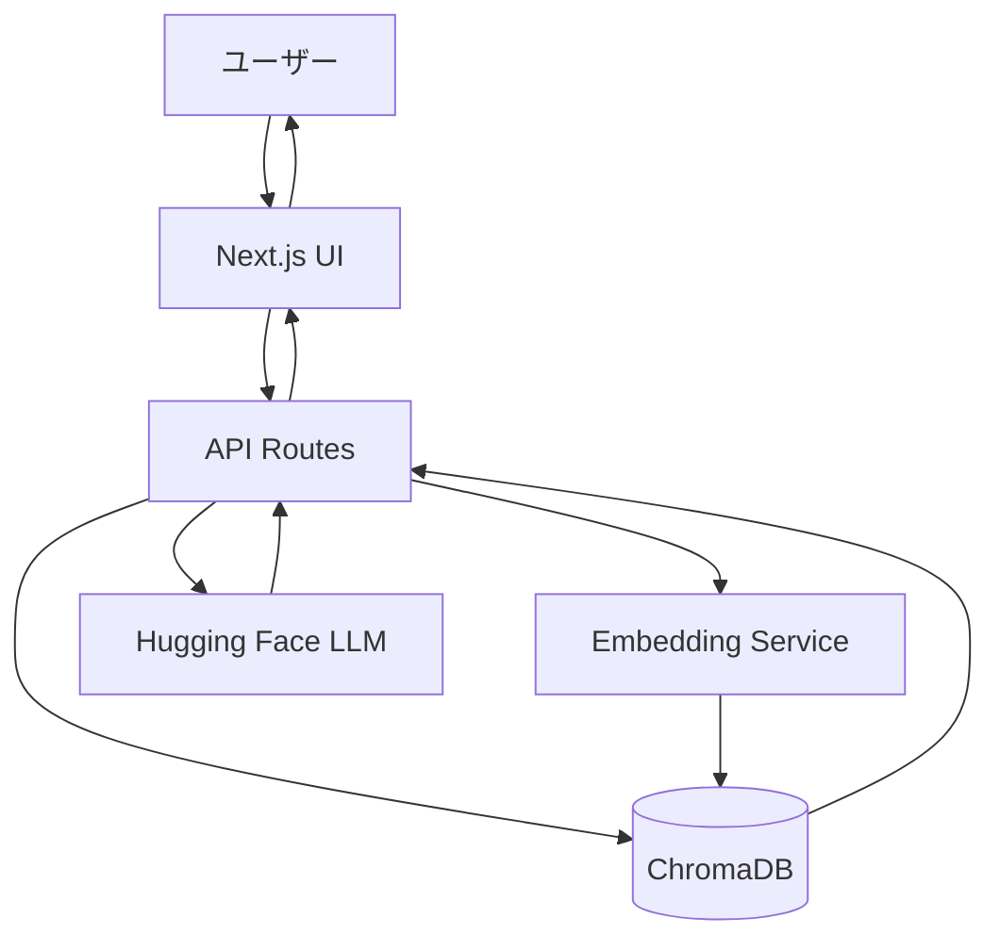
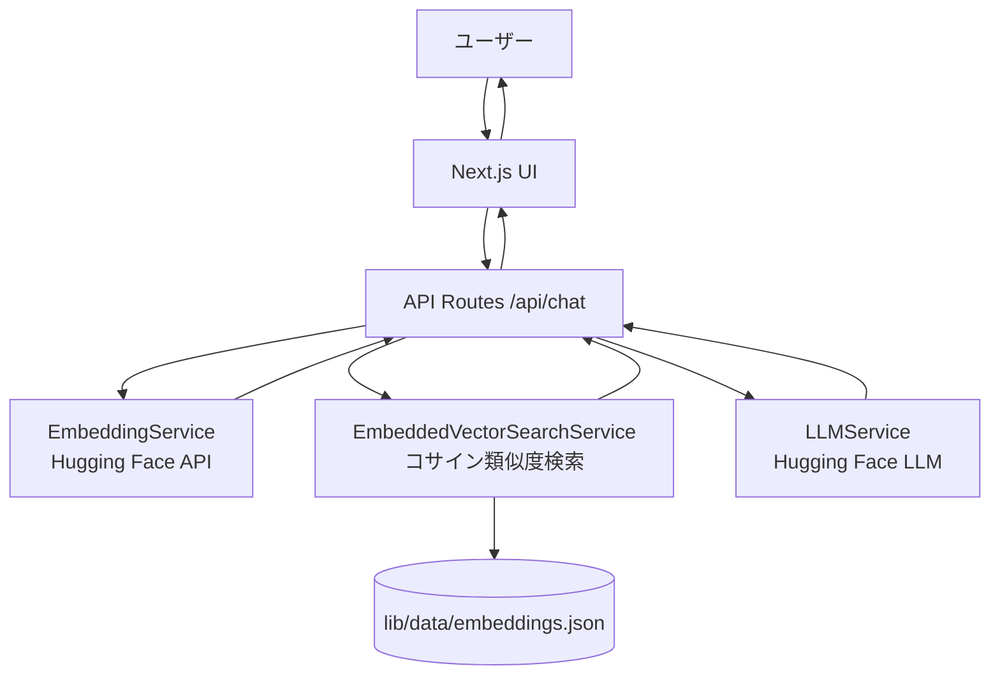
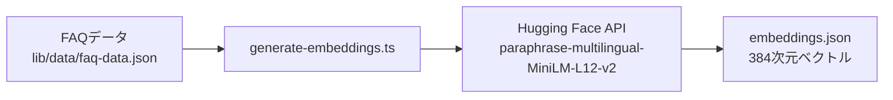

# 設計書

## 概要

RAGベースのAIチャットボットは、Next.js 14フレームワークを使用したWebアプリケーションとして実装されます。ユーザーの質問を受け取り、事前にベクトル化されたFAQデータ（JSONファイル）からコサイン類似度で関連情報を検索し、Hugging Faceの言語モデルを使用して回答を生成します。Vercelのサーバーレス環境にデプロイされます。

## 実装経緯と設計変更

### 当初の設計（ChromaDB使用）
当初はChromaDBをベクトルデータベースとして使用する予定でした。ローカル開発環境では`chroma_db`フォルダにChromaDBデータを配置し、正常に動作していました。

### 設計変更の理由
Vercelへのデプロイ時に、以下の問題が判明しました：
- Vercelのサーバーレス環境では、ChromaDBのようなファイルベースのデータベースを直接ホストできない
- ChromaDBはSQLiteを使用しており、サーバーレス関数の制約により動作しない
- 読み取り専用モードでも、ChromaDBクライアントの初期化に失敗する

### 最終的な実装方式（JSONファイルベースのインメモリベクトル検索）
上記の問題を解決するため、以下の方式に変更しました：
1. `scripts/generate-embeddings.ts` でFAQデータをHugging Face APIでベクトル化
2. ベクトルデータを `lib/data/embeddings.json` に保存
3. 実行時は `EmbeddedVectorSearchService` がJSONファイルをメモリに読み込み
4. ユーザーの質問をHugging Faceでベクトル化して、コサイン類似度で検索
5. 検索結果をLLMに渡して回答を生成

この方式により、Vercelのサーバーレス環境でも問題なく動作するようになりました。

## アーキテクチャ

### 当初の設計（参考）



### 最終実装のシステム構成図



### ベクトルデータ生成フロー



### 技術スタック

- **フロントエンド**: Next.js 14 (App Router), React, TypeScript, Tailwind CSS
- **バックエンド**: Next.js API Routes (サーバーレス関数)
- **ベクトルデータ**: JSON形式の埋め込みデータ（`lib/data/embeddings.json`）
- **ベクトル検索**: カスタム実装（`EmbeddedVectorSearchService`、コサイン類似度）
- **埋め込みモデル**: Hugging Face `sentence-transformers/paraphrase-multilingual-MiniLM-L12-v2`（多言語対応・384次元）
- **LLM**: Hugging Face Inference API `Qwen/Qwen2.5-7B-Instruct`（日本語対応・無料枠）
- **デプロイ**: Vercel
- **言語**: TypeScript

**注意**: `chroma_db`フォルダは参考として残されていますが、本番環境では使用されていません。

### デプロイアーキテクチャ

Vercelのサーバーレス環境に最適化された実装：

1. **ベクトルデータの配置**: `lib/data/embeddings.json`ファイルをプロジェクトに含める
2. **検索方式**: メモリ上でコサイン類似度計算を実行
3. **スケーラビリティ**: データサイズが50MB以下であれば問題なく動作
4. **将来の拡張**: データ量が増加した場合は、ChromaDB CloudやPineconeなどの外部サービスへの移行を検討

## コンポーネントとインターフェース

### フロントエンドコンポーネント

#### 1. ChatInterface
- **責務**: メインのチャット画面
- **機能**:
  - メッセージ履歴の表示
  - ユーザー入力フォーム
  - ローディング状態の管理

#### 2. MessageList
- **責務**: メッセージ履歴の表示
- **Props**:
  ```typescript
  interface Message {
    id: string;
    role: 'user' | 'assistant';
    content: string;
    timestamp: Date;
  }
  
  interface MessageListProps {
    messages: Message[];
  }
  ```

#### 3. MessageInput
- **責務**: ユーザー入力の受付
- **Props**:
  ```typescript
  interface MessageInputProps {
    onSend: (message: string) => void;
    disabled: boolean;
  }
  ```

#### 4. MessageBubble
- **責務**: 個別メッセージの表示
- **Props**:
  ```typescript
  interface MessageBubbleProps {
    message: Message;
  }
  ```

### バックエンドAPI

#### API Route: `/api/chat`

**リクエスト**:
```typescript
interface ChatRequest {
  message: string;
}
```

**レスポンス**:
```typescript
interface ChatResponse {
  response: string;
  sources?: string[];
  error?: string;
  errorCode?: ErrorCode;
}
```

**処理フロー**:
1. ユーザーのクエリを受信・バリデーション（1000文字以内）
2. EmbeddingServiceでクエリをベクトル化（Hugging Face API）
3. EmbeddedVectorSearchServiceでembeddings.jsonからコサイン類似度検索
4. 類似度スコアが閾値以上の結果をフィルタリング
5. コンテキストとクエリをLLMService経由でHugging Face LLMに送信
6. 生成された回答をレスポンスとして返す
7. ChatHistoryServiceで履歴を非同期保存（Supabase）

### サービス層

#### 1. EmbeddedVectorSearchService
```typescript
class EmbeddedVectorSearchService {
  private data: EmbeddingData[];
  private config: VectorSearchConfig;
  private initialized: boolean;
  
  async initialize(): Promise<void>;
  async search(queryEmbedding: number[], topK?: number): Promise<SearchResult[]>;
  private cosineSimilarity(a: number[], b: number[]): number;
  getConfig(): VectorSearchConfig;
  isInitialized(): boolean;
}

interface SearchResult {
  document: string;
  metadata: Record<string, any>;
  score: number;
}

interface EmbeddingData {
  id: string;
  document: string;
  embedding: number[];
  metadata: Record<string, any>;
}
```

**実装の特徴**:
- `lib/data/embeddings.json`ファイルからベクトルデータを読み込み（複数パスをフォールバック）
- コサイン類似度を使用して検索を実行
- 閾値（`scoreThreshold`）以上のスコアを持つ結果のみを返す
- シングルトンパターンで初期化済みインスタンスを再利用

#### 2. EmbeddingService
```typescript
class EmbeddingService {
  private client: HfInference;
  private modelName: string;
  
  async embedQuery(text: string): Promise<number[]>;
  getModelName(): string;
}
```

**使用モデル**: `sentence-transformers/paraphrase-multilingual-MiniLM-L12-v2`（384次元・多言語対応）

#### 3. LLMService
```typescript
class LLMService {
  private client: HfInference;
  private modelName: string;
  
  async generateResponse(
    query: string,
    context: string[]
  ): Promise<string>;
}
```

**使用モデル**: `Qwen/Qwen2.5-7B-Instruct`（日本語対応）

#### 4. ChatHistoryService
```typescript
class ChatHistoryService {
  async saveChat(sessionId: string, message: string, response: string): Promise<void>;
}
```

**データストア**: Supabase（オプション）

## データモデル

### Message
```typescript
interface Message {
  id: string;
  role: 'user' | 'assistant';
  content: string;
  timestamp: Date;
  sources?: string[];
}
```

### ChatState
```typescript
interface ChatState {
  messages: Message[];
  isLoading: boolean;
  error: string | null;
}
```

### VectorSearchConfig
```typescript
interface VectorSearchConfig {
  topK: number;              // 検索する上位K件（デフォルト: 3）
  scoreThreshold: number;    // 類似度の閾値（デフォルト: 0.7、日本語FAQは0.3-0.5推奨）
}
```

## エラーハンドリング

### エラータイプ

1. **VECTOR_DB_ERROR**: ベクトルデータ読み込み・検索エラー
2. **EMBEDDING_ERROR**: 埋め込み生成エラー
3. **LLM_ERROR**: Hugging Face LLM APIエラー
4. **RATE_LIMIT_ERROR**: APIレート制限エラー
5. **TIMEOUT_ERROR**: タイムアウトエラー
6. **NO_RELEVANT_DATA**: 関連データなし

### エラーメッセージ（日本語）

- `VECTOR_DB_ERROR`: "データベースへの接続に失敗しました。"
- `EMBEDDING_ERROR`: "質問の処理中にエラーが発生しました。"
- `LLM_ERROR`: "回答の生成中にエラーが発生しました。"
- `RATE_LIMIT_ERROR`: "現在、リクエストが集中しています。しばらく待ってから再度お試しください。"
- `TIMEOUT_ERROR`: "処理がタイムアウトしました。もう一度お試しください。"
- `NO_RELEVANT_DATA`: "申し訳ございません。ご質問に関連する情報がデータベースに見つかりませんでした。"

## 環境変数

```env
# Hugging Face（必須）
HUGGINGFACE_API_KEY=your_api_key_here

# Hugging Face モデル設定
HUGGINGFACE_MODEL=Qwen/Qwen2.5-7B-Instruct
HUGGINGFACE_EMBEDDING_MODEL=sentence-transformers/paraphrase-multilingual-MiniLM-L12-v2

# ベクトル検索設定
VECTOR_SEARCH_TOP_K=3
VECTOR_SEARCH_THRESHOLD=0.7

# タイムアウト設定
REQUEST_TIMEOUT=30000

# Supabase（チャット履歴保存用・オプション）
NEXT_PUBLIC_SUPABASE_URL=your_supabase_url
NEXT_PUBLIC_SUPABASE_ANON_KEY=your_supabase_anon_key
```

**環境変数の管理方針**:
- `HUGGINGFACE_API_KEY` はVercelダッシュボードで管理（秘密情報）
- それ以外のモデル名・閾値等は `vercel.json` で管理（コードと一緒にバージョン管理）

## セキュリティ考慮事項

1. **APIキーの保護**: 環境変数を使用し、クライアント側に露出させない
2. **レート制限**: API呼び出しの頻度制限を実装
3. **入力検証**: ユーザー入力のサニタイゼーション（1000文字制限）
4. **エラー情報**: 詳細なエラー情報をクライアントに返さない

## パフォーマンス最適化

1. **ベクトル検索の最適化**: topKを適切に設定（3-5件）
2. **サービスのシングルトン化**: 初期化済みインスタンスを再利用
3. **タイムアウト設定**: 30秒のタイムアウトを設定

## デプロイ手順

1. プロジェクトをGitHubにプッシュ
2. `lib/data/embeddings.json`ファイルが存在し、gitにコミットされていることを確認
3. Vercelでプロジェクトをインポート
4. 環境変数 `HUGGINGFACE_API_KEY` をVercelダッシュボードに設定
5. デプロイを実行

## FAQデータの更新手順

1. `lib/data/faq-data.json` のFAQデータを編集
2. `.env.local` にHugging Face APIキーを設定
3. `npx tsx scripts/generate-embeddings.ts` を実行してベクトルデータを再生成
4. 生成された `lib/data/embeddings.json` をコミット
5. プッシュして再デプロイ

詳細は `docs/FAQ_DATA_UPDATE_GUIDE.md` を参照。

## 制限事項

1. **ベクトルデータの更新**: `embeddings.json`ファイルを更新して再デプロイが必要
2. **データサイズ**: Vercelのデプロイ制限により、50MB以下を推奨
3. **Hugging Face無料枠**: レート制限あり
4. **実行時間制限**: Vercelのサーバーレス関数の実行時間制限（10秒 - Hobby、60秒 - Pro）
5. **ChromaDB**: ローカル開発では参考として`chroma_db`フォルダが存在しますが、本番環境では使用されません

## 将来的な拡張案

データ量が増加した場合の対応策：
1. **ChromaDB Cloud**: マネージドChromaDBサービスを使用
2. **Pinecone**: 専用のベクトルデータベースサービス
3. **Supabase Vector**: PostgreSQLベースのベクトル検索
4. **分割デプロイ**: 複数の`embeddings.json`ファイルに分割して読み込み
