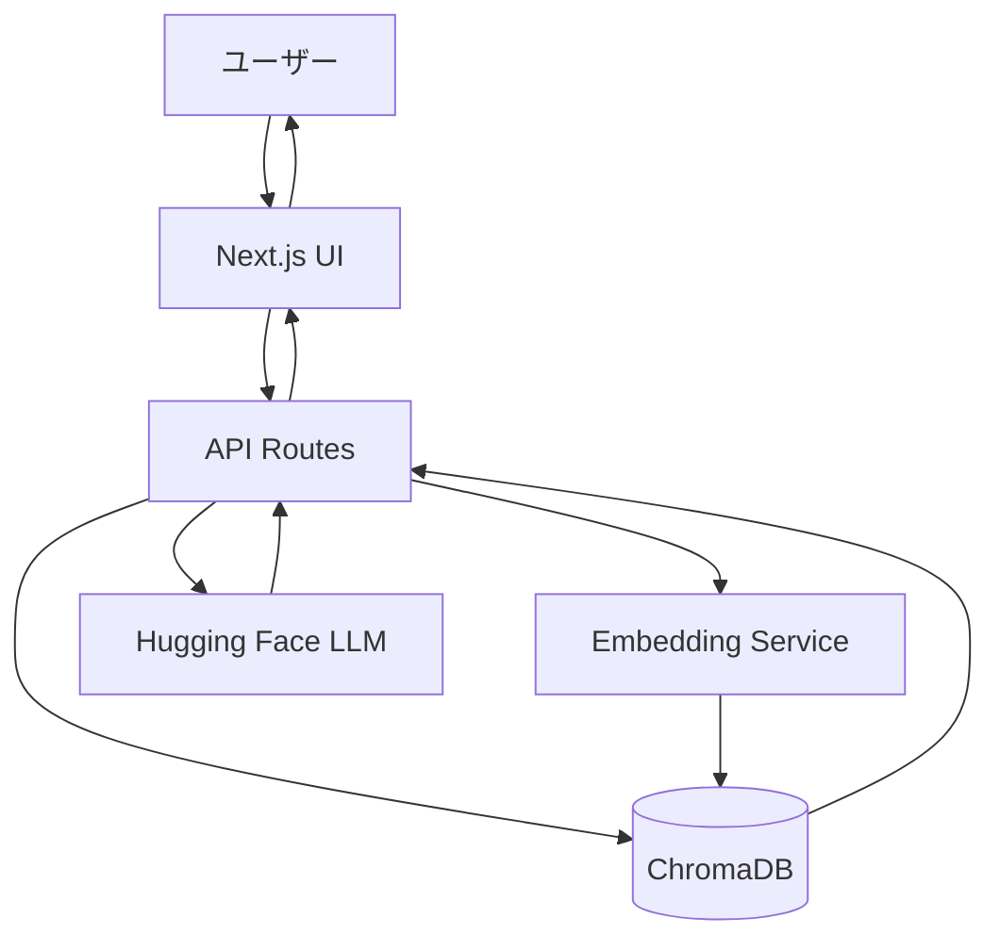

# 設計書

## 概要

RAGベースのAIチャットボットは、Next.jsフレームワークを使用したWebアプリケーションとして実装されます。ユーザーの質問を受け取り、ChromaDBベクトルデータベースから関連情報を検索し、Hugging Faceの言語モデルを使用して回答を生成します。Vercelのサーバーレス環境にデプロイされます。

## アーキテクチャ

### システム構成図



### 技術スタック

- **フロントエンド**: Next.js 14 (App Router), React, TypeScript, Tailwind CSS
- **バックエンド**: Next.js API Routes (サーバーレス関数)
- **ベクトルデータベース**: ChromaDB (既存のchroma_dbフォルダを使用)
- **埋め込みモデル**: Hugging Face Embeddings
- **LLM**: Hugging Face Inference API (無料枠)
- **デプロイ**: Vercel
- **言語**: TypeScript

### デプロイアーキテクチャ

Vercelのサーバーレス環境では、ChromaDBのような永続的なデータベースを直接ホストできないため、以下のアプローチを採用します：

1. **オプション1（推奨）**: ChromaDBデータをビルド時に含め、読み取り専用として使用
2. **オプション2**: 外部のChromaDBサーバーをホスト（別途必要）

本設計では、オプション1を採用し、既存のchroma_dbフォルダをプロジェクトに含めます。

## コンポーネントとインターフェース

### フロントエンドコンポーネント

#### 1. ChatInterface
- **責務**: メインのチャット画面
- **機能**:
  - メッセージ履歴の表示
  - ユーザー入力フォーム
  - ローディング状態の管理

#### 2. MessageList
- **責務**: メッセージ履歴の表示
- **Props**:
  ```typescript
  interface Message {
    id: string;
    role: 'user' | 'assistant';
    content: string;
    timestamp: Date;
  }
  
  interface MessageListProps {
    messages: Message[];
  }
  ```

#### 3. MessageInput
- **責務**: ユーザー入力の受付
- **Props**:
  ```typescript
  interface MessageInputProps {
    onSend: (message: string) => void;
    disabled: boolean;
  }
  ```

#### 4. MessageBubble
- **責務**: 個別メッセージの表示
- **Props**:
  ```typescript
  interface MessageBubbleProps {
    message: Message;
  }
  ```

### バックエンドAPI

#### API Route: `/api/chat`

**リクエスト**:
```typescript
interface ChatRequest {
  message: string;
}
```

**レスポンス**:
```typescript
interface ChatResponse {
  response: string;
  sources?: string[];
  error?: string;
}
```

**処理フロー**:
1. ユーザーのクエリを受信
2. クエリをベクトル化
3. ChromaDBから関連ドキュメントを検索
4. 類似度スコアをチェック
5. コンテキストとクエリをHugging Face LLMに送信
6. 生成された回答を返す

### サービス層

#### 1. VectorSearchService
```typescript
class VectorSearchService {
  private client: ChromaClient;
  private collection: Collection;
  
  async initialize(): Promise<void>;
  async search(query: string, topK: number): Promise<SearchResult[]>;
}

interface SearchResult {
  document: string;
  metadata: Record<string, any>;
  score: number;
}
```

#### 2. EmbeddingService
```typescript
class EmbeddingService {
  private apiKey: string;
  private modelName: string;
  
  async embedQuery(text: string): Promise<number[]>;
}
```

#### 3. LLMService
```typescript
class LLMService {
  private apiKey: string;
  private modelName: string;
  
  async generateResponse(
    query: string,
    context: string[]
  ): Promise<string>;
}
```

## データモデル

### Message
```typescript
interface Message {
  id: string;
  role: 'user' | 'assistant';
  content: string;
  timestamp: Date;
  sources?: string[];
}
```

### ChatState
```typescript
interface ChatState {
  messages: Message[];
  isLoading: boolean;
  error: string | null;
}
```

### VectorSearchConfig
```typescript
interface VectorSearchConfig {
  topK: number;              // 検索する上位K件（デフォルト: 3）
  scoreThreshold: number;    // 類似度の閾値（デフォルト: 0.7）
}
```

## エラーハンドリング

### エラータイプ

1. **VectorDBError**: ChromaDB接続・検索エラー
2. **EmbeddingError**: 埋め込み生成エラー
3. **LLMError**: Hugging Face APIエラー
4. **RateLimitError**: APIレート制限エラー
5. **TimeoutError**: タイムアウトエラー

### エラーレスポンス

```typescript
interface ErrorResponse {
  error: string;
  code: ErrorCode;
  message: string;
}

enum ErrorCode {
  VECTOR_DB_ERROR = 'VECTOR_DB_ERROR',
  EMBEDDING_ERROR = 'EMBEDDING_ERROR',
  LLM_ERROR = 'LLM_ERROR',
  RATE_LIMIT_ERROR = 'RATE_LIMIT_ERROR',
  TIMEOUT_ERROR = 'TIMEOUT_ERROR',
  NO_RELEVANT_DATA = 'NO_RELEVANT_DATA'
}
```

### エラーメッセージ（日本語）

- `VECTOR_DB_ERROR`: "データベースへの接続に失敗しました。"
- `EMBEDDING_ERROR`: "質問の処理中にエラーが発生しました。"
- `LLM_ERROR`: "回答の生成中にエラーが発生しました。"
- `RATE_LIMIT_ERROR`: "現在、リクエストが集中しています。しばらく待ってから再度お試しください。"
- `TIMEOUT_ERROR`: "処理がタイムアウトしました。もう一度お試しください。"
- `NO_RELEVANT_DATA`: "申し訳ございません。ご質問に関連する情報がデータベースに見つかりませんでした。"

## テスト戦略

### 単体テスト
- VectorSearchServiceの検索機能
- EmbeddingServiceの埋め込み生成
- LLMServiceの応答生成
- エラーハンドリングロジック

### 統合テスト
- API Routeのエンドツーエンドフロー
- ChromaDBとの統合
- Hugging Face APIとの統合

### E2Eテスト
- ユーザーがメッセージを送信して回答を受け取るフロー
- エラー状態の表示
- ローディング状態の表示

## 環境変数

```env
# Hugging Face
HUGGINGFACE_API_KEY=your_api_key_here
HUGGINGFACE_MODEL=mistralai/Mistral-7B-Instruct-v0.2

# Hugging Face (Embeddings用)
HUGGINGFACE_EMBEDDING_MODEL=sentence-transformers/all-MiniLM-L6-v2

# ChromaDB
CHROMA_DB_PATH=./chroma_db

# App Config
VECTOR_SEARCH_TOP_K=3
VECTOR_SEARCH_THRESHOLD=0.7
REQUEST_TIMEOUT=30000
```

## セキュリティ考慮事項

1. **APIキーの保護**: 環境変数を使用し、クライアント側に露出させない
2. **レート制限**: API呼び出しの頻度制限を実装
3. **入力検証**: ユーザー入力のサニタイゼーション
4. **エラー情報**: 詳細なエラー情報をクライアントに返さない

## パフォーマンス最適化

1. **ベクトル検索の最適化**: topKを適切に設定（3-5件）
2. **キャッシング**: 同一クエリの結果をキャッシュ（オプション）
3. **ストリーミング**: LLMレスポンスのストリーミング対応（将来的な改善）
4. **タイムアウト設定**: 30秒のタイムアウトを設定

## デプロイ手順

1. プロジェクトをGitHubにプッシュ
2. Vercelでプロジェクトをインポート
3. 環境変数を設定
4. chroma_dbフォルダがプロジェクトに含まれていることを確認
5. デプロイを実行

## 制限事項

1. ChromaDBは読み取り専用（新しいデータの追加不可）
2. Hugging Face無料枠のレート制限
3. Vercelのサーバーレス関数の実行時間制限（10秒 - Hobby、60秒 - Pro）
4. 会話履歴はセッション内のみ（永続化なし）
