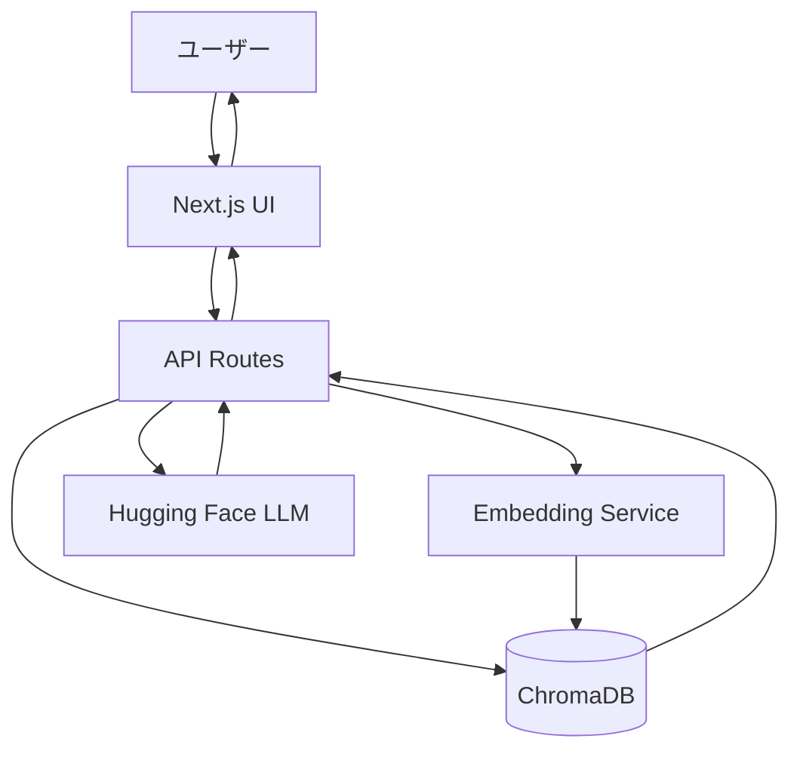
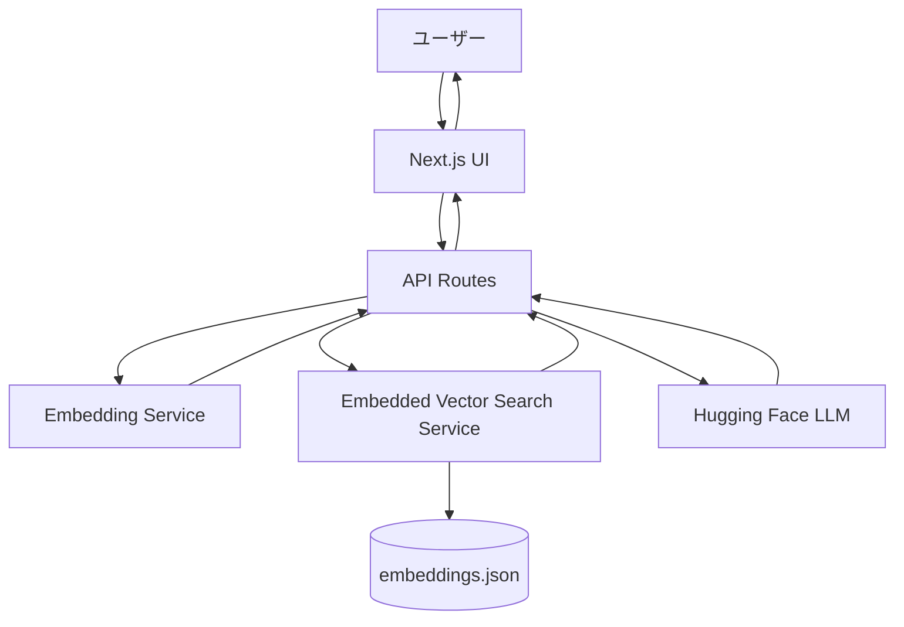

# 設計書

## 概要

RAGベースのAIチャットボットは、Next.jsフレームワークを使用したWebアプリケーションとして実装されます。ユーザーの質問を受け取り、ベクトルデータベースから関連情報を検索し、Hugging Faceの言語モデルを使用して回答を生成します。Vercelのサーバーレス環境にデプロイされます。

## 実装経緯と設計変更

### 当初の設計（ChromaDB使用）
当初はChromaDBをベクトルデータベースとして使用する予定でした。ローカル開発環境では`chroma_db`フォルダにChromaDBデータを配置し、正常に動作していました。

### 設計変更の理由
Vercelへのデプロイ時に、以下の問題が判明しました：
- Vercelのサーバーレス環境では、ChromaDBのようなファイルベースのデータベースを直接ホストできない
- ChromaDBはSQLiteを使用しており、サーバーレス関数の制約により動作しない
- 読み取り専用モードでも、ChromaDBクライアントの初期化に失敗する

### 最終的な実装方式
上記の問題を解決するため、以下の方式に変更しました：
1. ChromaDBデータを`embeddings.json`ファイルにエクスポート
2. カスタムの`EmbeddedVectorSearchService`を実装
3. JSON形式のベクトルデータをメモリに読み込み、コサイン類似度で検索

この方式により、Vercelのサーバーレス環境でも問題なく動作するようになりました。

## アーキテクチャ

### 当初の設計（参考）



### 最終実装のシステム構成図



### 技術スタック

- **フロントエンド**: Next.js 14 (App Router), React, TypeScript, Tailwind CSS
- **バックエンド**: Next.js API Routes (サーバーレス関数)
- **ベクトルデータ**: JSON形式の埋め込みデータ（`lib/data/embeddings.json`）
- **ベクトル検索**: カスタム実装（`EmbeddedVectorSearchService`）
- **埋め込みモデル**: Hugging Face Embeddings (sentence-transformers)
- **LLM**: Hugging Face Inference API (無料枠)
- **デプロイ**: Vercel
- **言語**: TypeScript

**注意**: `chroma_db`フォルダは参考として残されていますが、本番環境では使用されていません。

### デプロイアーキテクチャ

Vercelのサーバーレス環境に最適化された実装：

1. **ベクトルデータの配置**: `lib/data/embeddings.json`ファイルをプロジェクトに含める
2. **検索方式**: メモリ上でコサイン類似度計算を実行
3. **スケーラビリティ**: データサイズが50MB以下であれば問題なく動作
4. **将来の拡張**: データ量が増加した場合は、ChromaDB CloudやPineconeなどの外部サービスへの移行を検討

## コンポーネントとインターフェース

### フロントエンドコンポーネント

#### 1. ChatInterface
- **責務**: メインのチャット画面
- **機能**:
  - メッセージ履歴の表示
  - ユーザー入力フォーム
  - ローディング状態の管理

#### 2. MessageList
- **責務**: メッセージ履歴の表示
- **Props**:
  ```typescript
  interface Message {
    id: string;
    role: 'user' | 'assistant';
    content: string;
    timestamp: Date;
  }
  
  interface MessageListProps {
    messages: Message[];
  }
  ```

#### 3. MessageInput
- **責務**: ユーザー入力の受付
- **Props**:
  ```typescript
  interface MessageInputProps {
    onSend: (message: string) => void;
    disabled: boolean;
  }
  ```

#### 4. MessageBubble
- **責務**: 個別メッセージの表示
- **Props**:
  ```typescript
  interface MessageBubbleProps {
    message: Message;
  }
  ```

### バックエンドAPI

#### API Route: `/api/chat`

**リクエスト**:
```typescript
interface ChatRequest {
  message: string;
}
```

**レスポンス**:
```typescript
interface ChatResponse {
  response: string;
  sources?: string[];
  error?: string;
}
```

**処理フロー**:
1. ユーザーのクエリを受信
2. クエリをベクトル化
3. ChromaDBから関連ドキュメントを検索
4. 類似度スコアをチェック
5. コンテキストとクエリをHugging Face LLMに送信
6. 生成された回答を返す

### サービス層

#### 1. EmbeddedVectorSearchService
```typescript
class EmbeddedVectorSearchService {
  private data: EmbeddingData[];
  private config: VectorSearchConfig;
  private initialized: boolean;
  
  async initialize(): Promise<void>;
  async search(queryEmbedding: number[], topK?: number): Promise<SearchResult[]>;
  private cosineSimilarity(a: number[], b: number[]): number;
  getConfig(): VectorSearchConfig;
  isInitialized(): boolean;
}

interface SearchResult {
  document: string;
  metadata: Record<string, any>;
  score: number;
}

interface EmbeddingData {
  id: string;
  document: string;
  embedding: number[];
  metadata: Record<string, any>;
}
```

**実装の特徴**:
- `embeddings.json`ファイルからベクトルデータを読み込み
- コサイン類似度を使用して検索を実行
- 閾値（`scoreThreshold`）以上のスコアを持つ結果のみを返す

#### 2. EmbeddingService
```typescript
class EmbeddingService {
  private apiKey: string;
  private modelName: string;
  
  async embedQuery(text: string): Promise<number[]>;
}
```

#### 3. LLMService
```typescript
class LLMService {
  private apiKey: string;
  private modelName: string;
  
  async generateResponse(
    query: string,
    context: string[]
  ): Promise<string>;
}
```

## データモデル

### Message
```typescript
interface Message {
  id: string;
  role: 'user' | 'assistant';
  content: string;
  timestamp: Date;
  sources?: string[];
}
```

### ChatState
```typescript
interface ChatState {
  messages: Message[];
  isLoading: boolean;
  error: string | null;
}
```

### VectorSearchConfig
```typescript
interface VectorSearchConfig {
  topK: number;              // 検索する上位K件（デフォルト: 3）
  scoreThreshold: number;    // 類似度の閾値（デフォルト: 0.7）
}
```

## エラーハンドリング

### エラータイプ

1. **VectorDBError**: ChromaDB接続・検索エラー
2. **EmbeddingError**: 埋め込み生成エラー
3. **LLMError**: Hugging Face APIエラー
4. **RateLimitError**: APIレート制限エラー
5. **TimeoutError**: タイムアウトエラー

### エラーレスポンス

```typescript
interface ErrorResponse {
  error: string;
  code: ErrorCode;
  message: string;
}

enum ErrorCode {
  VECTOR_DB_ERROR = 'VECTOR_DB_ERROR',
  EMBEDDING_ERROR = 'EMBEDDING_ERROR',
  LLM_ERROR = 'LLM_ERROR',
  RATE_LIMIT_ERROR = 'RATE_LIMIT_ERROR',
  TIMEOUT_ERROR = 'TIMEOUT_ERROR',
  NO_RELEVANT_DATA = 'NO_RELEVANT_DATA'
}
```

### エラーメッセージ（日本語）

- `VECTOR_DB_ERROR`: "データベースへの接続に失敗しました。"
- `EMBEDDING_ERROR`: "質問の処理中にエラーが発生しました。"
- `LLM_ERROR`: "回答の生成中にエラーが発生しました。"
- `RATE_LIMIT_ERROR`: "現在、リクエストが集中しています。しばらく待ってから再度お試しください。"
- `TIMEOUT_ERROR`: "処理がタイムアウトしました。もう一度お試しください。"
- `NO_RELEVANT_DATA`: "申し訳ございません。ご質問に関連する情報がデータベースに見つかりませんでした。"

## テスト戦略

### 単体テスト
- VectorSearchServiceの検索機能
- EmbeddingServiceの埋め込み生成
- LLMServiceの応答生成
- エラーハンドリングロジック

### 統合テスト
- API Routeのエンドツーエンドフロー
- ChromaDBとの統合
- Hugging Face APIとの統合

### E2Eテスト
- ユーザーがメッセージを送信して回答を受け取るフロー
- エラー状態の表示
- ローディング状態の表示

## 環境変数

```env
# Hugging Face
HUGGINGFACE_API_KEY=your_api_key_here
HUGGINGFACE_MODEL=mistralai/Mistral-7B-Instruct-v0.2

# Hugging Face (Embeddings用)
HUGGINGFACE_EMBEDDING_MODEL=sentence-transformers/all-MiniLM-L6-v2

# ChromaDB（参考：現在は使用されていません）
# CHROMA_DB_PATH=./chroma_db
# 注意: 将来的にChromaDB Cloudなどの外部サービスを使用する場合に備えて残しています

# App Config
VECTOR_SEARCH_TOP_K=3
VECTOR_SEARCH_THRESHOLD=0.7
REQUEST_TIMEOUT=30000
```

**環境変数の説明**:
- `CHROMA_DB_PATH`: 現在は使用されていませんが、将来的な拡張のために定義を残しています
- 実際のベクトルデータは`lib/data/embeddings.json`から読み込まれます

## セキュリティ考慮事項

1. **APIキーの保護**: 環境変数を使用し、クライアント側に露出させない
2. **レート制限**: API呼び出しの頻度制限を実装
3. **入力検証**: ユーザー入力のサニタイゼーション
4. **エラー情報**: 詳細なエラー情報をクライアントに返さない

## パフォーマンス最適化

1. **ベクトル検索の最適化**: topKを適切に設定（3-5件）
2. **キャッシング**: 同一クエリの結果をキャッシュ（オプション）
3. **ストリーミング**: LLMレスポンスのストリーミング対応（将来的な改善）
4. **タイムアウト設定**: 30秒のタイムアウトを設定

## デプロイ手順

1. プロジェクトをGitHubにプッシュ
2. `lib/data/embeddings.json`ファイルが存在し、gitにコミットされていることを確認
3. Vercelでプロジェクトをインポート
4. 環境変数を設定（`HUGGINGFACE_API_KEY`は必須）
5. デプロイを実行
6. デプロイ後、`/api/health`エンドポイントで動作確認

## 制限事項

1. **ベクトルデータの更新**: `embeddings.json`ファイルを更新して再デプロイが必要
2. **データサイズ**: Vercelのデプロイ制限により、50MB以下を推奨
3. **Hugging Face無料枠**: レート制限あり（1時間あたり約1000リクエスト）
4. **実行時間制限**: Vercelのサーバーレス関数の実行時間制限（10秒 - Hobby、60秒 - Pro）
5. **会話履歴**: セッション内のみ（永続化なし）
6. **ChromaDB**: ローカル開発では参考として`chroma_db`フォルダが存在しますが、本番環境では使用されません

## 将来的な拡張案

データ量が増加した場合の対応策：
1. **ChromaDB Cloud**: マネージドChromaDBサービスを使用
2. **Pinecone**: 専用のベクトルデータベースサービス
3. **Supabase Vector**: PostgreSQLベースのベクトル検索
4. **分割デプロイ**: 複数の`embeddings.json`ファイルに分割して読み込み
