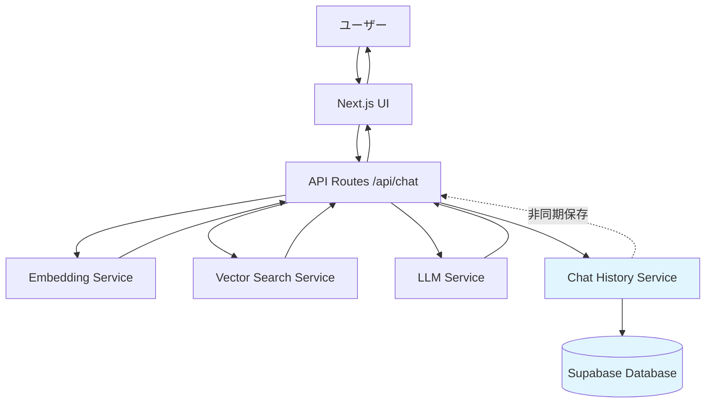

# 設計書

## 概要

チャット履歴保存機能は、ユーザーの質問とAIの回答をペアとしてSupabaseデータベースに保存する機能です。既存のNext.js APIルート（`/api/chat`）に統合され、チャット機能に影響を与えることなく履歴を記録します。

## アーキテクチャ

### システム構成図



### 技術スタック

- **既存スタック**: Next.js 14, TypeScript, Hugging Face API
- **新規追加**: Supabase Client (`@supabase/supabase-js`)
- **データベース**: Supabase PostgreSQL

### 設計原則

1. **非侵襲性**: 既存のチャット機能に影響を与えない
2. **エラー分離**: 履歴保存の失敗がチャット機能を妨げない
3. **非同期処理**: 履歴保存は非同期で実行し、レスポンスを遅延させない
4. **シンプル性**: 最小限のコードで実装

## データモデル

### Supabaseテーブル設計

#### テーブル名: `chat_history`

| カラム名 | データ型 | 制約 | 説明 |
|---------|---------|------|------|
| id | uuid | PRIMARY KEY, DEFAULT uuid_generate_v4() | レコードの一意識別子 |
| question | text | NOT NULL | ユーザーからの質問 |
| answer | text | NOT NULL | AIが生成した回答 |
| created_at | timestamptz | NOT NULL, DEFAULT now() | レコード作成日時 |

#### SQL定義

```sql
CREATE TABLE chat_history (
  id uuid PRIMARY KEY DEFAULT uuid_generate_v4(),
  question text NOT NULL,
  answer text NOT NULL,
  created_at timestamptz NOT NULL DEFAULT now()
);

-- インデックス（検索パフォーマンス向上のため）
CREATE INDEX idx_chat_history_created_at ON chat_history(created_at DESC);
```

### TypeScript型定義

```typescript
interface ChatHistoryRecord {
  id?: string;
  question: string;
  answer: string;
  created_at?: string;
}
```

## コンポーネントとインターフェース

### 新規サービス: ChatHistoryService

```typescript
class ChatHistoryService {
  private supabase: SupabaseClient;
  
  constructor();
  async saveChat(question: string, answer: string): Promise<void>;
  private handleError(error: unknown, context: string): void;
}
```

#### メソッド詳細

##### `constructor()`
- Supabase クライアントを初期化
- 環境変数から接続情報を取得
- エラーハンドリング付き

##### `saveChat(question: string, answer: string): Promise<void>`
- 質問と回答をデータベースに保存
- 非同期で実行（await不要）
- エラーが発生してもthrowしない（ログのみ）

##### `handleError(error: unknown, context: string): void`
- エラーをコンソールにログ出力
- エラーの詳細情報を記録

### 既存API修正: `/api/chat`

#### 修正箇所

```typescript
// 既存のレスポンス生成後に追加
const generatedResponse = await llmService!.generateResponse(
  userMessage,
  contextDocuments,
  { timeout }
);

// 新規追加: 履歴保存（非同期、エラーを無視）
try {
  const historyService = new ChatHistoryService();
  // awaitせずに非同期で実行
  historyService.saveChat(userMessage, generatedResponse).catch(error => {
    console.error('Failed to save chat history:', error);
  });
} catch (error) {
  // 初期化エラーもログのみ
  console.error('Failed to initialize chat history service:', error);
}

// 既存のレスポンス返却
return NextResponse.json({
  response: generatedResponse,
  sources: sources,
});
```

## エラーハンドリング

### エラー処理方針

1. **履歴保存エラー**: ログに記録するのみ、チャット機能は継続
2. **Supabase接続エラー**: サービス初期化時にログ記録
3. **データベースエラー**: 保存時にログ記録

### エラーログ形式

```typescript
// 初期化エラー
console.error('[ChatHistoryService] Initialization failed:', error);

// 保存エラー
console.error('[ChatHistoryService] Failed to save chat:', {
  question: question.substring(0, 50),
  error: error instanceof Error ? error.message : String(error)
});
```

## 環境変数

### 新規追加

```env
# Supabase Configuration
NEXT_PUBLIC_SUPABASE_URL=your_supabase_project_url
NEXT_PUBLIC_SUPABASE_ANON_KEY=your_supabase_anon_key
```

### .env.example への追加

```env
# ============================================
# Supabase Configuration (オプション)
# ============================================
# Supabaseプロジェクト URL
# 取得方法: Supabaseダッシュボード > Settings > API
NEXT_PUBLIC_SUPABASE_URL=https://your-project.supabase.co

# Supabase匿名キー（公開可能）
# 取得方法: Supabaseダッシュボード > Settings > API > anon public
NEXT_PUBLIC_SUPABASE_ANON_KEY=your_supabase_anon_key_here
```

## セキュリティ考慮事項

1. **Row Level Security (RLS)**: Supabaseテーブルに適切なRLSポリシーを設定
2. **匿名キーの使用**: `NEXT_PUBLIC_SUPABASE_ANON_KEY`を使用（公開可能）
3. **データ検証**: 保存前に質問と回答の長さを検証（オプション）

### Supabase RLSポリシー例

```sql
-- 全ユーザーが挿入可能（匿名ユーザー含む）
CREATE POLICY "Enable insert for all users" ON chat_history
  FOR INSERT
  WITH CHECK (true);

-- 読み取りは無効化（管理者のみ）
CREATE POLICY "Disable read for public" ON chat_history
  FOR SELECT
  USING (false);
```

## テスト戦略

### 単体テスト
- `ChatHistoryService.saveChat()` の正常系
- `ChatHistoryService.saveChat()` のエラーハンドリング
- Supabase接続エラーのハンドリング

### 統合テスト
- `/api/chat` エンドポイントでの履歴保存
- 履歴保存失敗時のチャット機能継続

### 手動テスト
1. Supabaseダッシュボードでテーブル作成
2. 環境変数設定
3. チャット実行後、Supabaseでレコード確認

## 実装の流れ

1. Supabaseプロジェクト作成とテーブル設定
2. `@supabase/supabase-js` パッケージのインストール
3. `ChatHistoryService` の実装
4. `/api/chat` への統合
5. 環境変数の設定
6. テストと動作確認

## パフォーマンス考慮事項

1. **非同期保存**: `await`を使わず、Promise を返すのみ
2. **エラー無視**: 保存失敗してもレスポンスを遅延させない
3. **インデックス**: `created_at` にインデックスを作成

## 制限事項

1. **認証なし**: 現時点ではユーザー認証を実装しない
2. **履歴表示UI**: データベースに保存するのみ、表示機能は含まない
3. **データ削除**: 自動削除機能なし（手動またはSupabase関数で実装可能）

## 将来的な拡張案

1. **ユーザー認証**: Supabase Authを使用したユーザー管理
2. **履歴表示UI**: 過去の会話を表示するページ
3. **検索機能**: 履歴内のテキスト検索
4. **データ保持期間**: 古いレコードの自動削除
5. **分析機能**: よくある質問の分析
