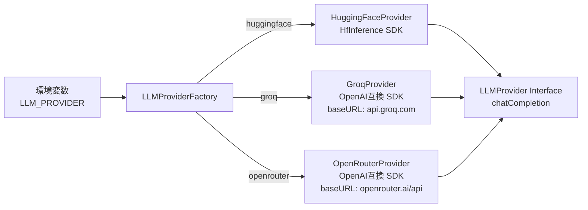
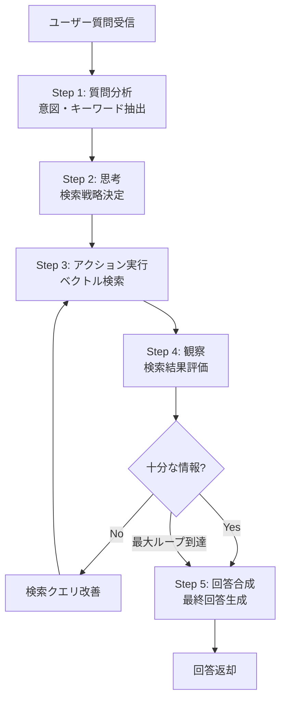
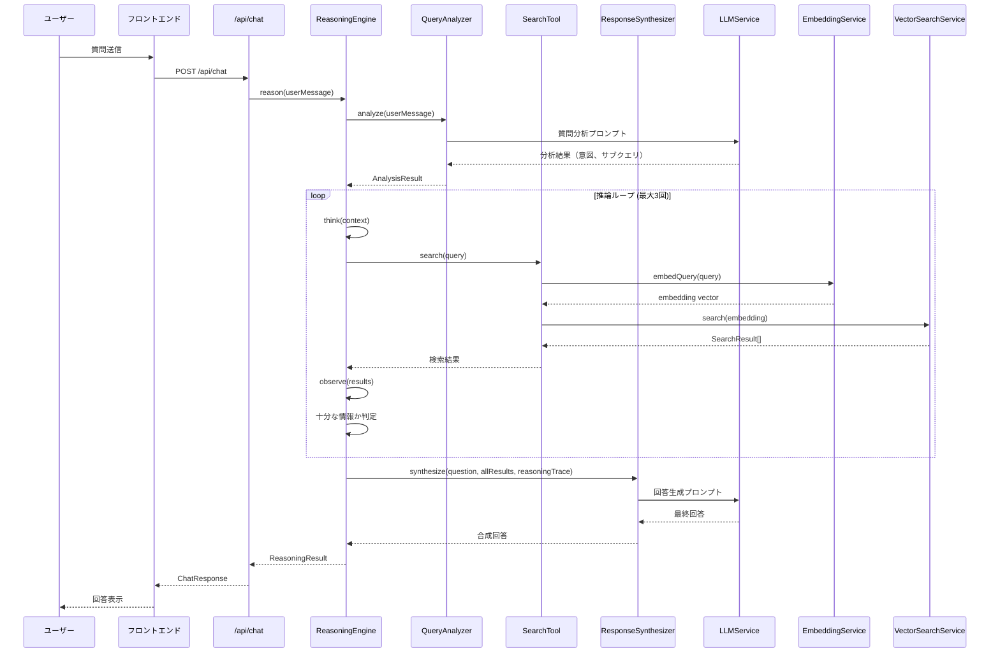
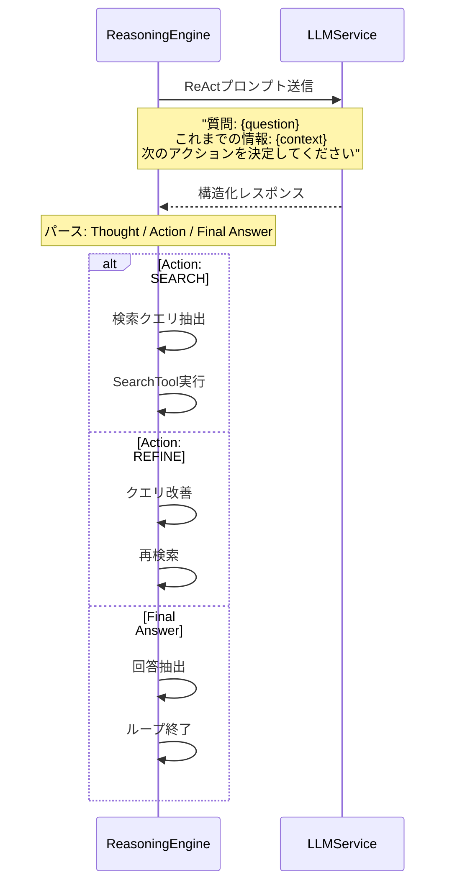

# 設計ドキュメント: Retrieval-Based (Reasoning) AI

## 概要

ワンダーランド東京 FAQ AIチャットボットのAI実装を、現在の単純なRAG（Retrieval-Augmented Generation）から「探索ベース（Reasoning）AI」に進化させる。具体的には、ユーザーの質問に対して単一のベクトル検索＋LLM回答生成ではなく、**多段階推論（Multi-Step Reasoning）**を導入する。AIが質問を分析し、必要に応じて複数回の検索を行い、検索結果を評価・統合して最終回答を生成する「ReAct（Reasoning + Acting）」パターンを採用する。

無料サービスの制約を考慮し、Hugging Face Inference API（無料枠）を引き続き使用する。推論ループはサーバーサイド（Next.js API Route）で実装し、LLMの出力をパースして「思考」「アクション」「最終回答」を制御する。これにより、複雑な質問や曖昧な質問に対しても、段階的に情報を収集・推論して正確な回答を提供できるようになる。

さらに、**LLMプロバイダー切り替え機能**を導入し、環境変数の設定のみで Hugging Face / Groq / OpenRouter を切り替えられるようにする。Groq と OpenRouter は OpenAI互換APIを提供しているため、`openai` パッケージを使用して baseURL と apiKey を切り替えるだけで対応可能。これにより、推論特化モデル（DeepSeek-R1系）との比較検証が容易になる。

## 段階的開発方針

本機能は以下の3フェーズで段階的に開発する：

| Phase | 内容 | LLMプロバイダー | モデル | 目的 |
|-------|------|----------------|--------|------|
| **Phase 1** | ReAct推論エンジン実装 | Hugging Face | Qwen/Qwen2.5-7B-Instruct | 日本語安定、ロジック差の検証に最適 |
| **Phase 2** | LLMプロバイダー切り替え機能実装 | Hugging Face（デフォルト） | 同上 | プロバイダー抽象化レイヤー構築 |
| **Phase 3** | 推論特化モデル比較 | Groq / OpenRouter | deepseek-r1-distill-qwen-32b / deepseek/deepseek-r1:free | 推論品質・速度の比較検証 |

### Phase 1: ReAct推論エンジン（現行）

- 現在の Hugging Face + Qwen2.5-7B-Instruct を使用
- ReActパターンの推論ループを実装
- 日本語での安定した応答を確認しながら、推論ロジックの品質を検証
- この段階では LLMService の既存インターフェースを維持

### Phase 2: LLMプロバイダー切り替え機能

- LLMService をリファクタリングし、プロバイダー抽象化レイヤーを導入
- `LLMProviderFactory` によるプロバイダーインスタンス生成
- 環境変数による切り替え:
  ```
  LLM_PROVIDER=huggingface  # or groq, openrouter
  LLM_MODEL=Qwen/Qwen2.5-7B-Instruct
  LLM_API_KEY=xxx
  ```
- 既存の `HUGGINGFACE_API_KEY` / `HUGGINGFACE_MODEL` 環境変数との後方互換性を維持

### Phase 3: 推論特化モデル比較

- Groq: `deepseek-r1-distill-qwen-32b`（高速推論、無料枠あり）
- OpenRouter: `deepseek/deepseek-r1:free`（無料、推論特化）
- 比較観点: 推論品質、応答速度、日本語対応、ReActフォーマット遵守率
- `/llm-compare` ページで比較結果を可視化

## アーキテクチャ

### 全体構成

```mermaid
graph TD
    User[ユーザー] --> Frontend[フロントエンド<br/>ChatInterface]
    Frontend --> API["/api/chat<br/>Next.js API Route"]
    API --> ReasoningEngine[ReasoningEngine<br/>推論エンジン]
    ReasoningEngine --> QueryAnalyzer[QueryAnalyzer<br/>質問分析]
    ReasoningEngine --> SearchTool[SearchTool<br/>検索ツール]
    ReasoningEngine --> ResponseSynthesizer[ResponseSynthesizer<br/>回答合成]
    
    QueryAnalyzer --> LLM[LLMService<br/>プロバイダー抽象化]
    ResponseSynthesizer --> LLM
    LLM --> ProviderFactory[LLMProviderFactory]
    ProviderFactory --> HF_Provider[HuggingFaceProvider<br/>@huggingface/inference]
    ProviderFactory --> Groq_Provider[GroqProvider<br/>openai互換]
    ProviderFactory --> OR_Provider[OpenRouterProvider<br/>openai互換]
    HF_Provider --> HF_API2[Hugging Face API<br/>Qwen2.5-7B-Instruct]
    Groq_Provider --> Groq_API[Groq API<br/>deepseek-r1-distill-qwen-32b]
    OR_Provider --> OR_API[OpenRouter API<br/>deepseek/deepseek-r1:free]
    
    SearchTool --> Embedding[EmbeddingService<br/>ベクトル化]
    SearchTool --> VectorSearch[EmbeddedVectorSearchService<br/>類似度検索]
    Embedding --> HF_API[Hugging Face API<br/>paraphrase-multilingual-MiniLM-L12-v2]
    VectorSearch --> EmbeddingsJSON[embeddings.json<br/>FAQデータ]
    
    API --> ChatHistory[ChatHistoryService<br/>Supabase]
```

### LLMプロバイダー切り替え構成



### ReAct推論ループ



## シーケンス図

### メイン処理フロー



### 推論ステップ詳細



## コンポーネントとインターフェース

### Component 1: ReasoningEngine（推論エンジン）

**目的**: ReActパターンに基づく多段階推論を制御するメインオーケストレーター

**インターフェース**:
```typescript
interface ReasoningEngine {
  reason(query: string, options?: ReasoningOptions): Promise<ReasoningResult>;
  getReasoningTrace(): ReasoningStep[];
}

interface ReasoningOptions {
  maxIterations?: number;      // 最大推論ループ回数（デフォルト: 3）
  timeout?: number;            // タイムアウト（ms）
  verbose?: boolean;           // 詳細ログ出力
}

interface ReasoningResult {
  answer: string;              // 最終回答
  sources: string[];           // 参照ソース
  reasoningSteps: ReasoningStep[];  // 推論過程
  totalSearches: number;       // 実行した検索回数
  confidence: number;          // 回答の確信度 (0-1)
}
```

**責務**:
- 推論ループの制御（開始、継続判定、終了）
- 各ステップ（思考→アクション→観察）の実行管理
- タイムアウトと最大イテレーション数の制御
- 推論トレースの記録

### Component 2: QueryAnalyzer（質問分析）

**目的**: ユーザーの質問を分析し、検索戦略を決定する

**インターフェース**:
```typescript
interface QueryAnalyzer {
  analyze(query: string): Promise<QueryAnalysis>;
}

interface QueryAnalysis {
  intent: QueryIntent;           // 質問の意図
  subQueries: string[];          // 分解されたサブクエリ
  keywords: string[];            // 重要キーワード
  complexity: 'simple' | 'moderate' | 'complex';  // 複雑度
}

type QueryIntent = 
  | 'factual'        // 事実確認（営業時間、料金など）
  | 'comparison'     // 比較（アトラクション比較など）
  | 'procedural'     // 手順（チケット購入方法など）
  | 'exploratory';   // 探索的（おすすめなど）
```

**責務**:
- 質問の意図分類
- 複雑な質問のサブクエリへの分解
- キーワード抽出
- 質問の複雑度判定

### Component 3: SearchTool（検索ツール）

**目的**: 既存のEmbedding + VectorSearchを統合した検索インターフェース

**インターフェース**:
```typescript
interface SearchTool {
  search(query: string, options?: SearchOptions): Promise<SearchToolResult>;
}

interface SearchOptions {
  topK?: number;
  threshold?: number;
}

interface SearchToolResult {
  documents: string[];
  scores: number[];
  hasRelevantResults: boolean;
  bestScore: number;
}
```

**責務**:
- クエリのベクトル化と検索の一括実行
- 検索結果の関連性評価
- 結果のフォーマット

### Component 4: ResponseSynthesizer（回答合成）

**目的**: 推論過程と検索結果を統合して最終回答を生成する

**インターフェース**:
```typescript
interface ResponseSynthesizer {
  synthesize(
    originalQuery: string,
    searchResults: SearchToolResult[],
    reasoningTrace: ReasoningStep[]
  ): Promise<SynthesizedResponse>;
}

interface SynthesizedResponse {
  answer: string;
  confidence: number;
  sources: string[];
}
```

**責務**:
- 複数の検索結果の統合
- 推論過程を考慮した回答生成
- 回答の確信度評価
- ソース情報の整理

### Component 5: LLMProviderFactory（LLMプロバイダーファクトリー）

**目的**: 環境変数に基づいて適切なLLMプロバイダーインスタンスを生成するファクトリー

**インターフェース**:
```typescript
// プロバイダー共通インターフェース
interface LLMProvider {
  chatCompletion(params: ChatCompletionParams): Promise<ChatCompletionResult>;
  getProviderName(): string;
  getModelName(): string;
}

interface ChatCompletionParams {
  messages: ChatMessage[];
  maxTokens?: number;
  temperature?: number;
}

interface ChatMessage {
  role: 'system' | 'user' | 'assistant';
  content: string;
}

interface ChatCompletionResult {
  content: string;
  usage?: {
    promptTokens: number;
    completionTokens: number;
    totalTokens: number;
  };
}

// プロバイダー設定
type LLMProviderType = 'huggingface' | 'groq' | 'openrouter';

interface LLMProviderConfig {
  provider: LLMProviderType;
  model: string;
  apiKey: string;
  baseURL?: string;           // Groq/OpenRouter用
  timeout?: number;
}

// ファクトリー
interface LLMProviderFactory {
  create(config?: LLMProviderConfig): LLMProvider;
  createFromEnv(): LLMProvider;
}
```

**責務**:
- 環境変数 `LLM_PROVIDER` に基づくプロバイダー選択
- プロバイダー固有の設定（baseURL、apiKey）の解決
- `LLMProvider` インターフェースに準拠したインスタンス生成
- 後方互換性の維持（`HUGGINGFACE_API_KEY` 環境変数のフォールバック）

### Component 6: HuggingFaceProvider

**目的**: Hugging Face Inference API を使用したLLMプロバイダー実装

**インターフェース**:
```typescript
class HuggingFaceProvider implements LLMProvider {
  constructor(apiKey: string, model?: string);
  chatCompletion(params: ChatCompletionParams): Promise<ChatCompletionResult>;
  getProviderName(): string;  // → 'huggingface'
  getModelName(): string;     // → 'Qwen/Qwen2.5-7B-Instruct'
}
```

**責務**:
- `@huggingface/inference` SDK を使用した API 呼び出し
- Hugging Face 固有のレスポンスフォーマットの変換
- レート制限エラーのハンドリング

### Component 7: OpenAICompatibleProvider（Groq / OpenRouter 共通）

**目的**: OpenAI互換APIを使用したLLMプロバイダー実装（Groq、OpenRouter共通）

**インターフェース**:
```typescript
class OpenAICompatibleProvider implements LLMProvider {
  constructor(config: {
    apiKey: string;
    baseURL: string;
    model: string;
    providerName: string;
    defaultHeaders?: Record<string, string>;
  });
  chatCompletion(params: ChatCompletionParams): Promise<ChatCompletionResult>;
  getProviderName(): string;  // → 'groq' | 'openrouter'
  getModelName(): string;
}
```

**プロバイダー別設定**:

| プロバイダー | baseURL | デフォルトモデル | 備考 |
|-------------|---------|-----------------|------|
| Groq | `https://api.groq.com/openai/v1` | `deepseek-r1-distill-qwen-32b` | 高速推論、無料枠あり |
| OpenRouter | `https://openrouter.ai/api/v1` | `deepseek/deepseek-r1:free` | 無料モデル利用可能 |

**責務**:
- `openai` パッケージを使用した OpenAI互換 API 呼び出し
- baseURL の切り替えによるプロバイダー選択
- プロバイダー固有ヘッダーの付与（OpenRouter の場合 `HTTP-Referer` 等）

## データモデル

### LLMProviderConfig（プロバイダー設定）

```typescript
/**
 * 環境変数からのプロバイダー設定解決
 */
interface EnvironmentConfig {
  // 新しい統一環境変数（優先）
  LLM_PROVIDER?: 'huggingface' | 'groq' | 'openrouter';
  LLM_MODEL?: string;
  LLM_API_KEY?: string;
  
  // 後方互換性（LLM_PROVIDER未設定時のフォールバック）
  HUGGINGFACE_API_KEY?: string;
  HUGGINGFACE_MODEL?: string;
}

/**
 * プロバイダー別デフォルト設定
 */
const PROVIDER_DEFAULTS: Record<LLMProviderType, { baseURL?: string; model: string }> = {
  huggingface: {
    model: 'Qwen/Qwen2.5-7B-Instruct',
  },
  groq: {
    baseURL: 'https://api.groq.com/openai/v1',
    model: 'deepseek-r1-distill-qwen-32b',
  },
  openrouter: {
    baseURL: 'https://openrouter.ai/api/v1',
    model: 'deepseek/deepseek-r1:free',
  },
};
```

**環境変数の優先順位**:
1. `LLM_PROVIDER` + `LLM_MODEL` + `LLM_API_KEY`（新しい統一形式）
2. `HUGGINGFACE_API_KEY` + `HUGGINGFACE_MODEL`（後方互換フォールバック → provider = 'huggingface'）

**バリデーションルール**:
- `LLM_PROVIDER` が設定されている場合、`LLM_API_KEY` は必須
- `LLM_PROVIDER` が未設定の場合、`HUGGINGFACE_API_KEY` にフォールバック
- `LLM_MODEL` が未設定の場合、プロバイダーのデフォルトモデルを使用

### ReasoningStep（推論ステップ）

```typescript
interface ReasoningStep {
  stepNumber: number;
  type: 'thought' | 'action' | 'observation';
  content: string;
  timestamp: number;
  metadata?: {
    searchQuery?: string;
    searchResults?: number;
    confidence?: number;
  };
}
```

**バリデーションルール**:
- `stepNumber` は1以上の整数
- `type` は 'thought' | 'action' | 'observation' のいずれか
- `content` は空文字列不可
- `timestamp` は正の整数（Unix timestamp ms）

### ReActPromptTemplate（プロンプトテンプレート）

```typescript
interface ReActPromptTemplate {
  systemPrompt: string;
  userPromptTemplate: string;
  parsePattern: RegExp;
}

interface ParsedLLMResponse {
  thought: string | null;
  action: ReActAction | null;
  finalAnswer: string | null;
}

type ReActAction = 
  | { type: 'SEARCH'; query: string }
  | { type: 'REFINE'; originalQuery: string; refinedQuery: string }
  | { type: 'DONE'; answer: string };
```

**バリデーションルール**:
- `ParsedLLMResponse` は `thought`、`action`、`finalAnswer` のうち少なくとも1つが非null
- `action.type` が 'SEARCH' の場合、`query` は空文字列不可
- `action.type` が 'REFINE' の場合、`originalQuery` と `refinedQuery` は異なる値

## アルゴリズム擬似コード

### LLMプロバイダー生成アルゴリズム

```typescript
/**
 * 環境変数からLLMプロバイダーを生成する
 */
function createProviderFromEnv(): LLMProvider {
  const providerType = process.env.LLM_PROVIDER as LLMProviderType | undefined;
  
  // 新しい統一環境変数が設定されている場合
  if (providerType) {
    const apiKey = process.env.LLM_API_KEY;
    if (!apiKey) {
      throw new Error('LLM_API_KEY is required when LLM_PROVIDER is set');
    }
    
    const model = process.env.LLM_MODEL || PROVIDER_DEFAULTS[providerType].model;
    const baseURL = PROVIDER_DEFAULTS[providerType].baseURL;
    
    if (providerType === 'huggingface') {
      return new HuggingFaceProvider(apiKey, model);
    } else {
      // Groq / OpenRouter は OpenAI互換
      return new OpenAICompatibleProvider({
        apiKey,
        baseURL: baseURL!,
        model,
        providerName: providerType,
        defaultHeaders: providerType === 'openrouter' 
          ? { 'HTTP-Referer': process.env.APP_URL || 'http://localhost:3000' }
          : undefined,
      });
    }
  }
  
  // 後方互換フォールバック: HUGGINGFACE_API_KEY
  const hfApiKey = process.env.HUGGINGFACE_API_KEY;
  if (!hfApiKey) {
    throw new Error('LLM_API_KEY or HUGGINGFACE_API_KEY is required');
  }
  
  const hfModel = process.env.HUGGINGFACE_MODEL || 'Qwen/Qwen2.5-7B-Instruct';
  return new HuggingFaceProvider(hfApiKey, hfModel);
}
```

**前提条件:**
- 環境変数が読み取り可能
- `LLM_PROVIDER` が設定されている場合、値は 'huggingface' | 'groq' | 'openrouter' のいずれか

**事後条件:**
- 返却される `LLMProvider` は `chatCompletion` メソッドを持つ有効なインスタンス
- プロバイダー固有の設定（baseURL、ヘッダー等）が正しく適用されている

### メイン推論アルゴリズム

```typescript
/**
 * ReAct推論ループのメインアルゴリズム
 */
async function reason(query: string, options: ReasoningOptions): Promise<ReasoningResult> {
  const maxIterations = options.maxIterations ?? 3;
  const reasoningSteps: ReasoningStep[] = [];
  const allSearchResults: SearchToolResult[] = [];
  let currentContext = '';
  let iteration = 0;

  // Step 1: 質問分析
  const analysis = await queryAnalyzer.analyze(query);
  
  // 単純な質問は1回の検索で回答
  if (analysis.complexity === 'simple') {
    const result = await searchTool.search(query);
    if (result.hasRelevantResults) {
      const response = await responseSynthesizer.synthesize(query, [result], []);
      return { answer: response.answer, sources: response.sources, reasoningSteps: [], totalSearches: 1, confidence: response.confidence };
    }
  }

  // Step 2: 推論ループ
  while (iteration < maxIterations) {
    iteration++;

    // 思考: LLMに次のアクションを決定させる
    const reactPrompt = buildReActPrompt(query, currentContext, analysis);
    const llmResponse = await llmService.generateRaw(reactPrompt);
    const parsed = parseReActResponse(llmResponse);

    // 思考ステップ記録
    if (parsed.thought) {
      reasoningSteps.push({ stepNumber: reasoningSteps.length + 1, type: 'thought', content: parsed.thought, timestamp: Date.now() });
    }

    // 最終回答が得られた場合、ループ終了
    if (parsed.finalAnswer) {
      return buildFinalResult(parsed.finalAnswer, allSearchResults, reasoningSteps);
    }

    // アクション実行
    if (parsed.action) {
      const searchQuery = parsed.action.type === 'SEARCH' ? parsed.action.query : parsed.action.refinedQuery;
      reasoningSteps.push({ stepNumber: reasoningSteps.length + 1, type: 'action', content: `SEARCH: ${searchQuery}`, timestamp: Date.now() });

      const searchResult = await searchTool.search(searchQuery);
      allSearchResults.push(searchResult);

      // 観察: 検索結果をコンテキストに追加
      currentContext += formatSearchResults(searchResult);
      reasoningSteps.push({ stepNumber: reasoningSteps.length + 1, type: 'observation', content: `${searchResult.documents.length}件の結果取得 (最高スコア: ${searchResult.bestScore.toFixed(3)})`, timestamp: Date.now() });
    }
  }

  // 最大イテレーション到達: 収集した情報で回答合成
  const response = await responseSynthesizer.synthesize(query, allSearchResults, reasoningSteps);
  return { answer: response.answer, sources: response.sources, reasoningSteps, totalSearches: allSearchResults.length, confidence: response.confidence };
}
```

**前提条件:**
- `query` は空でない文字列
- `options.maxIterations` は1以上の整数
- LLMService、SearchTool、QueryAnalyzer が初期化済み

**事後条件:**
- 返却される `ReasoningResult.answer` は空でない文字列
- `reasoningSteps` は実行順に記録される
- `totalSearches` は実際に実行された検索回数と一致

**ループ不変条件:**
- `iteration <= maxIterations`
- `allSearchResults.length <= iteration`
- `currentContext` は各イテレーションで単調増加（情報追加のみ）

### ReActレスポンスパーサー

```typescript
/**
 * LLMのReActレスポンスをパースする
 */
function parseReActResponse(response: string): ParsedLLMResponse {
  const result: ParsedLLMResponse = { thought: null, action: null, finalAnswer: null };

  // Thought抽出
  const thoughtMatch = response.match(/Thought:\s*(.+?)(?=\nAction:|$)/s);
  if (thoughtMatch) {
    result.thought = thoughtMatch[1].trim();
  }

  // Final Answer抽出（優先）
  const answerMatch = response.match(/Final Answer:\s*(.+?)$/s);
  if (answerMatch) {
    result.finalAnswer = answerMatch[1].trim();
    return result;
  }

  // Action抽出
  const actionMatch = response.match(/Action:\s*(SEARCH|REFINE)\s*\nAction Input:\s*(.+?)(?=\n|$)/s);
  if (actionMatch) {
    const actionType = actionMatch[1] as 'SEARCH' | 'REFINE';
    const actionInput = actionMatch[2].trim();

    if (actionType === 'SEARCH') {
      result.action = { type: 'SEARCH', query: actionInput };
    } else {
      result.action = { type: 'REFINE', originalQuery: '', refinedQuery: actionInput };
    }
  }

  return result;
}
```

**前提条件:**
- `response` は空でない文字列
- LLMからの出力は「Thought:」「Action:」「Final Answer:」のいずれかを含む

**事後条件:**
- 返却値の `thought`、`action`、`finalAnswer` のうち少なくとも1つが非null
- パースに失敗した場合でも例外をスローしない（graceful degradation）

### ReActプロンプト構築

```typescript
/**
 * ReActプロンプトを構築する
 */
function buildReActPrompt(
  query: string,
  currentContext: string,
  analysis: QueryAnalysis
): string {
  const systemPrompt = `あなたはワンダーランド東京のFAQアシスタントです。
ユーザーの質問に答えるために、段階的に考え、必要な情報を検索してください。

以下のフォーマットで回答してください：

Thought: [現在の状況と次に何をすべきかの考え]
Action: SEARCH
Action Input: [検索クエリ]

または、十分な情報が集まった場合：

Thought: [最終的な考え]
Final Answer: [ユーザーへの回答]

ルール:
- コンテキストに含まれない情報は推測しないでください
- 検索結果が不十分な場合は、別の角度から検索してください
- 最終回答は日本語で、丁寧に回答してください`;

  const userPrompt = `質問: ${query}
質問の意図: ${analysis.intent}
キーワード: ${analysis.keywords.join(', ')}

${currentContext ? `これまでに得られた情報:\n${currentContext}\n` : ''}
次のステップを決定してください。`;

  return `${systemPrompt}\n\n${userPrompt}`;
}
```

**前提条件:**
- `query` は空でない文字列
- `analysis` は有効な `QueryAnalysis` オブジェクト

**事後条件:**
- 返却されるプロンプトはシステムプロンプトとユーザープロンプトを含む
- `currentContext` が空の場合、「これまでに得られた情報」セクションは省略される

## 使用例

### LLMプロバイダー切り替え

```typescript
// 環境変数による切り替え（.env.local）
// --- Hugging Face（デフォルト、Phase 1） ---
// LLM_PROVIDER=huggingface
// LLM_MODEL=Qwen/Qwen2.5-7B-Instruct
// LLM_API_KEY=hf_xxxxx

// --- Groq（Phase 3） ---
// LLM_PROVIDER=groq
// LLM_MODEL=deepseek-r1-distill-qwen-32b
// LLM_API_KEY=gsk_xxxxx

// --- OpenRouter（Phase 3） ---
// LLM_PROVIDER=openrouter
// LLM_MODEL=deepseek/deepseek-r1:free
// LLM_API_KEY=sk-or-xxxxx

// プロバイダーファクトリーの使用
import { LLMProviderFactory } from '@/lib/services/LLMProviderFactory';

const factory = new LLMProviderFactory();
const provider = factory.createFromEnv();

console.log(provider.getProviderName()); // → 'huggingface' | 'groq' | 'openrouter'
console.log(provider.getModelName());    // → 設定されたモデル名

// chatCompletion の呼び出し（プロバイダー非依存）
const result = await provider.chatCompletion({
  messages: [
    { role: 'system', content: 'あなたはFAQアシスタントです。' },
    { role: 'user', content: '営業時間を教えてください。' },
  ],
  maxTokens: 512,
  temperature: 0.7,
});

console.log(result.content); // → LLMの応答テキスト
```

### LLMServiceでの統合（後方互換）

```typescript
// 更新後のLLMService（内部でLLMProviderを使用）
export class LLMService {
  private provider: LLMProvider;
  private defaultTimeout: number;

  constructor(apiKey?: string, modelName?: string) {
    // 明示的にパラメータが渡された場合はHuggingFaceを使用（後方互換）
    if (apiKey) {
      this.provider = new HuggingFaceProvider(apiKey, modelName);
    } else {
      // 環境変数からプロバイダーを自動選択
      const factory = new LLMProviderFactory();
      this.provider = factory.createFromEnv();
    }
    this.defaultTimeout = parseInt(process.env.REQUEST_TIMEOUT || '30000');
  }

  async generateResponse(query: string, context: string[], options?: GenerateResponseOptions): Promise<string> {
    // 既存のインターフェースを維持
    const result = await this.provider.chatCompletion({
      messages: [
        { role: 'system', content: SYSTEM_PROMPT },
        { role: 'user', content: buildUserPrompt(query, context) },
      ],
      maxTokens: options?.maxTokens || 512,
      temperature: options?.temperature || 0.7,
    });
    return result.content;
  }

  getModelName(): string {
    return this.provider.getModelName();
  }

  getProviderName(): string {
    return this.provider.getProviderName();
  }
}
```

### 基本的な使用例

```typescript
// ReasoningEngineの初期化
const reasoningEngine = new ReasoningEngine({
  llmService: new LLMService(),
  embeddingService: new EmbeddingService(),
  vectorSearchService: vectorSearchService,
  maxIterations: 3,
  timeout: 45000,
});

// 単純な質問（1回の検索で回答）
const simpleResult = await reasoningEngine.reason('営業時間は？');
// → { answer: "ワンダーランド東京の営業時間は...", totalSearches: 1, confidence: 0.95 }

// 複雑な質問（複数回の検索が必要）
const complexResult = await reasoningEngine.reason(
  '子供連れで行く場合、おすすめのアトラクションと食事場所を教えてください'
);
// → { answer: "お子様連れの場合...", totalSearches: 3, confidence: 0.85 }
// reasoningSteps: [
//   { type: 'thought', content: '子供向けアトラクションと食事場所の2つの情報が必要' },
//   { type: 'action', content: 'SEARCH: 子供 アトラクション おすすめ' },
//   { type: 'observation', content: '3件の結果取得 (最高スコア: 0.82)' },
//   { type: 'thought', content: 'アトラクション情報は得られた。次は食事場所を検索' },
//   { type: 'action', content: 'SEARCH: 食事 レストラン 子供' },
//   { type: 'observation', content: '2件の結果取得 (最高スコア: 0.78)' },
//   { type: 'thought', content: '十分な情報が集まった。回答を合成する' },
// ]
```

### API Routeでの統合

```typescript
// app/api/chat/route.ts での使用
export async function POST(request: NextRequest): Promise<NextResponse<ChatResponse>> {
  const { message } = await request.json();
  
  const reasoningEngine = getReasoningEngine(); // シングルトン取得
  const result = await reasoningEngine.reason(message, {
    maxIterations: 3,
    timeout: 45000,
  });

  return NextResponse.json({
    response: result.answer,
    sources: result.sources,
    reasoning: result.reasoningSteps, // オプション: 推論過程を返却
  });
}
```

## 正当性プロパティ

1. **終了保証**: 推論ループは必ず `maxIterations` 回以内で終了する
   - ∀ query, options: reason(query, options).totalSearches ≤ options.maxIterations

2. **回答非空**: 正常終了時、回答は必ず空でない文字列を返す
   - ∀ result ∈ ReasoningResult: result.answer.length > 0

3. **推論ステップ整合性**: 推論ステップは時系列順に記録される
   - ∀ i < j: reasoningSteps[i].timestamp ≤ reasoningSteps[j].timestamp

4. **検索回数一致**: totalSearches は実際の検索実行回数と一致する
   - ∀ result: result.totalSearches === countActionsOfType(result.reasoningSteps, 'action')

5. **確信度範囲**: confidence は 0 以上 1 以下
   - ∀ result: 0 ≤ result.confidence ≤ 1

6. **単純質問最適化**: 単純な質問は1回の検索で回答される
   - ∀ query where complexity === 'simple' ∧ hasRelevantResults: totalSearches === 1

7. **コンテキスト単調増加**: 推論ループ中、コンテキストは情報が追加されるのみ
   - ∀ iteration i < j: context[i] ⊆ context[j]

## エラーハンドリング

### エラーシナリオ 1: LLMレスポンスパース失敗

**条件**: LLMの出力が期待されるReActフォーマットに従わない場合
**対応**: 
- パース失敗時はフォールバックとして、現在のコンテキストで直接回答を生成
- 推論ステップに「パース失敗」を記録
**回復**: 次のイテレーションで再試行、または収集済み情報で回答合成

### エラーシナリオ 2: 検索結果なし（全イテレーション）

**条件**: すべての検索で関連結果が見つからない場合
**対応**: 
- 既存の `ErrorCode.NO_RELEVANT_DATA` レスポンスを返却
- 推論ステップに検索失敗を記録
**回復**: ユーザーに質問の言い換えを提案

### エラーシナリオ 3: タイムアウト

**条件**: 推論ループ全体が `timeout` を超過した場合
**対応**: 
- 現在までに収集した情報で部分的な回答を生成
- `confidence` を低く設定（0.3以下）
- 推論ステップに「タイムアウト」を記録
**回復**: 部分回答を返却し、ユーザーに再質問を促す

### エラーシナリオ 4: Hugging Face API レート制限

**条件**: 無料枠のレート制限に到達した場合
**対応**: 
- 既存の `ErrorCode.RATE_LIMIT_ERROR` を返却
- 推論ループを即座に中断
**回復**: ユーザーに待機を促すメッセージを表示

### エラーシナリオ 5: LLMプロバイダー接続エラー

**条件**: 設定されたプロバイダー（Groq / OpenRouter）への接続が失敗した場合
**対応**: 
- プロバイダー固有のエラーメッセージを記録
- `ErrorCode.LLM_CONNECTION_ERROR` を返却
**回復**: 
- 環境変数の設定確認を促すメッセージを表示
- 将来的にはフォールバックプロバイダーへの自動切り替えを検討

### エラーシナリオ 6: プロバイダー設定不正

**条件**: `LLM_PROVIDER` に無効な値が設定されている、または必要な環境変数が不足している場合
**対応**: 
- アプリケーション起動時にバリデーションエラーをスロー
- 明確なエラーメッセージで不足している設定を通知
**回復**: `.env.local` の設定を修正

## テスト戦略

### ユニットテスト

- **ReActレスポンスパーサー**: 各種フォーマットのLLM出力を正しくパースできること
- **QueryAnalyzer**: 質問の意図分類と複雑度判定が正確であること
- **ReasoningEngine**: 推論ループの制御（最大イテレーション、タイムアウト）が正しく動作すること
- **SearchTool**: 既存のEmbedding + VectorSearchの統合が正しく動作すること
- **LLMProviderFactory**: 環境変数に基づいて正しいプロバイダーが生成されること
- **OpenAICompatibleProvider**: Groq/OpenRouter の baseURL とヘッダーが正しく設定されること
- **後方互換性**: `HUGGINGFACE_API_KEY` のみ設定時に HuggingFaceProvider が使用されること

### プロパティベーステスト

**テストライブラリ**: fast-check

- **終了保証テスト**: 任意の入力に対して推論ループが有限回で終了すること
- **パーサー堅牢性テスト**: 任意の文字列入力に対してパーサーが例外をスローしないこと
- **確信度範囲テスト**: 任意の検索結果に対して confidence が [0, 1] 範囲内であること

### 統合テスト

- **エンドツーエンドフロー**: 質問送信から回答返却までの全フローが正常に動作すること
- **フォールバック動作**: LLMエラー時に適切なフォールバックが実行されること
- **既存機能との互換性**: ChatHistoryService との連携が維持されること
- **プロバイダー切り替え**: 各プロバイダー（HuggingFace / Groq / OpenRouter）で推論ループが正常に動作すること
- **プロバイダー間比較**: 同一質問に対する各プロバイダーの応答品質・速度の比較テスト

## パフォーマンス考慮事項

### レイテンシ

- 単純な質問: 1回の検索 + 1回のLLM呼び出し ≈ 現在と同等（3-5秒）
- 複雑な質問: 最大3回の検索 + 複数回のLLM呼び出し ≈ 10-15秒
- タイムアウト設定: 45秒（Vercelの無料枠制限を考慮）

### プロバイダー別レイテンシ特性

| プロバイダー | 推定レイテンシ | 特徴 |
|-------------|--------------|------|
| Hugging Face (Qwen2.5-7B) | 3-8秒/リクエスト | 安定だがやや遅い、日本語品質良好 |
| Groq (deepseek-r1-distill-qwen-32b) | 0.5-2秒/リクエスト | LPUによる超高速推論 |
| OpenRouter (deepseek-r1:free) | 2-10秒/リクエスト | 無料枠のため混雑時に遅延あり |

### Hugging Face API 無料枠制限

- Inference API 無料枠: レート制限あり（モデルにより異なる）
- 推論ループにより API 呼び出し回数が増加するため、レート制限に注意
- 対策: 単純な質問は推論ループをスキップ、キャッシュの活用

### Vercel デプロイ制約

- Serverless Function タイムアウト: 無料枠は10秒（Pro は60秒）
- 対策: `maxIterations` を2に制限、または Vercel Pro プランを検討
- 代替案: Edge Runtime の使用（タイムアウト制限が緩い）

## セキュリティ考慮事項

- **プロンプトインジェクション対策**: ユーザー入力をReActプロンプトに埋め込む際、システムプロンプトとユーザー入力を明確に分離
- **情報漏洩防止**: 推論ステップ（内部思考過程）はデフォルトではフロントエンドに返却しない（デバッグモードのみ）
- **入力バリデーション**: 既存の1000文字制限を維持
- **API キー保護**: 環境変数経由でのみアクセス（既存の仕組みを維持）
- **複数プロバイダーのAPIキー管理**: 
  - 各プロバイダーのAPIキーは `LLM_API_KEY` 環境変数で一元管理
  - `.env.local` はgitignoreに含まれていることを確認
  - フロントエンドにAPIキーやプロバイダー情報が露出しないよう、サーバーサイドのみで使用
- **OpenRouter固有**: `HTTP-Referer` ヘッダーにアプリケーションURLを設定（利用規約準拠）

## 依存関係

### 既存依存関係（変更なし）
- `@huggingface/inference` ^4.13.15 - Hugging Face API クライアント
- `@supabase/supabase-js` ^2.80.0 - チャット履歴保存
- `next` ^14.2.0 - フレームワーク

### 新規依存関係
- `openai` ^4.x - OpenAI互換APIクライアント（Groq / OpenRouter 用）
  - Groq: `baseURL: 'https://api.groq.com/openai/v1'` で接続
  - OpenRouter: `baseURL: 'https://openrouter.ai/api/v1'` で接続
  - Phase 2 で導入

### 外部サービス
- Hugging Face Inference API（無料枠）- Phase 1〜
  - Embedding: `sentence-transformers/paraphrase-multilingual-MiniLM-L12-v2`
  - LLM: `Qwen/Qwen2.5-7B-Instruct`
- Groq API（無料枠）- Phase 3〜
  - LLM: `deepseek-r1-distill-qwen-32b`
  - 高速推論（Groq LPU による低レイテンシ）
- OpenRouter API（無料モデル）- Phase 3〜
  - LLM: `deepseek/deepseek-r1:free`
  - 無料枠で推論特化モデルを利用可能
- Supabase（チャット履歴）- 既存
